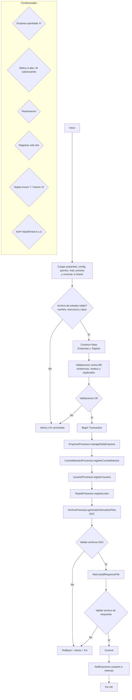

Proceso Batch: Alta de Clientes Banorte

Este proyecto ejecuta el alta de clientes y la generación de archivos SGC a partir de un archivo de entrada. Incluye validaciones de entrada/salida, operaciones en Oracle y notificaciones por correo.

1) Configuración
- config/constant_config.properties: rutas y nombres de archivos (LIST_FILES, FILE_PATH_SGC, FILE_PATH_RESPUESTA, FILE_NAME_OUTPUT, FILE_EXT, etc.).
- config/constant_process.properties: parámetros de proceso y estructura del archivo de entrada.
- config/constant_queries.properties: claves de sentencias SQL usadas por los processors.
- config/constant_mail.properties: SMTP, remitentes y destinatarios.
- oracle.properties (o -Doracle.config=...): propiedades de conexión a Oracle.

2) Ejecución
- IDE: ejecutar com.novo.main.Main.
- Línea de comandos (Windows):
  - Compilar: gradlew.bat build
  - Ejecutar: java -Doracle.config=oracle.properties -cp "build\\classes\\java\\main;lib\\*" com.novo.main.Main

3) Flujo paso a paso (Main.main)
1. Cargar properties (queries, config, mail, process) y conexión Oracle (dbinterface).
2. Validar archivo de entrada: ValidadorProcessor.verifyFormatInterfaceAlta().
3. Construir listas: getListEmpresa(...) y getListTarjeta(...).
4. Validaciones contra BD: verifyDataInterfaceAlta(...) y verifyExistNroCuenta(...).
5. Iniciar transacción.
6. Registrar/actualizar: EmpresaProcessor, CuentaMaestraProcessor, UsuarioProcessor, TarjetaProcessor.
7. Generar archivos SGC: ArchivoProcessor.generateInformationFiles(...).
8. Validar archivos SGC (nuevo): Main.validateSgcFiles(pConfig).
9. Generar archivo de respuesta: Main.buildResponseFile(pConfig, listaEmpresa).
10. Validar archivo de respuesta (nuevo): Main.validateResponseFile(pConfig).
11. Commit y envío de notificaciones; en fallas, rollback y alerta.

4) Validación de archivo de entrada
- verifyFormatInterfaceAlta() y checkInterfaceAlta(...): nombre y estructura del archivo (arcentrada/), tipos de registro y cantidad de campos.
- verifyDataInterfaceAlta(...): cruces con BD (existencia/estatus de empresa/usuario, etc.).
- verifyExistNroCuenta(...): prevención de duplicidades de cuenta/tarjeta.

5) Validación de archivos de salida (nuevo)
- validateSgcFiles(pConfig): valida existencia y tamaño > 0 de cada archivo en LIST_FILES (FILE_PATH_SGC + nombre + FILE_EXT).
- validateResponseFile(pConfig): valida existencia y tamaño > 0 del archivo de respuesta (FILE_PATH_RESPUESTA + FILE_NAME_OUTPUT con %%ODATE + FILE_EXT).
- Si falla alguna validación: rollback, enviar alerta y terminar el proceso con código 1.

6) Sentencias SQL (flujo detallado: qué se inserta/actualiza/borrado y condicionales)
- Todas las sentencias están parametrizadas en config/constant_queries.properties y son consumidas por los processors. A continuación se detalla qué hace cada bloque, en qué tabla opera y bajo qué condiciones se ejecuta.

6.1 Empresa (EmpresaProcessor.manageDataEmpresa)
- Condición general de ALTA: se ejecuta si la empresa viene Aprobada (Respuesta.nvpResultado = 'A'), motivo = 'A', no es reactivación (isReactivacionCuenta = false) y no es "solo lote" (isRegistrarSoloLote = false).
  - SQL_REGISTRO_EMPRESA (INSERT → MAESTRO_CLIENTES_TEBCA)
    • Inserta el cliente (RIF/CIRIF_CLIENTE = NVP-CTA-ADMIN, nombres, email, categoría, zona, etc.).
    • Nota: NVP-INDSRVNA se normaliza en código: si empresa.nvpIndsrvna = 'N' se envía 'BRAND-2023', de lo contrario 'BRAND-2020'. Además CATEGORY toma el último dígito de NVP-IDSERVICIO-G.
  - SQL_REGISTRO_DIRECCION_EMPRESA (INSERT → TEB_DIRECCIONES)
    • Inserta dirección básica por defecto asociada al RIF.
  - SQL_REGISTRO_SUCURSAL_EMPRESA (INSERT → TEB_SUC_EMPRESA)
    • Crea la sucursal principal para el RIF.
  - SQL_REGISTRO_ASIG_PRODUCTO_EMPRESA (INSERT → TEB_EMPRES_PRODUC)
    • Asigna el producto/prefijo (por defecto T1) a la empresa.
  - SQL_REGISTRO_ASIG_COMISION_EMPRESA (INSERT → TEB_COMISION)
    • Parametriza comisiones base en 0 para el prefijo T1.
  - SQL_REGISTRO_EXON_COMISION_EMPRESA (INSERT → TEB_EXONERA_COMISION)
    • Se ejecuta solo si en constant_config.properties existe la clave SQL_REGISTRO_EXON_COMISION_EMPRESA = 'S'. Exonera comisiones para T1.
  - SQL_REGISTRO_ASIG_IMPUESTO (INSERT → IMPUESTO_EMPRESA)
    • Se inserta una fila por cada tipo de lote en LISTA_TIPO_ASIG_LOTE (propiedad: 1,3,5). Asigna impuestos/exoneraciones para cada tipo.
  - SQL_REGISTRO_SOLICITUD_EMI_BNT (INSERT → SOLICITUD_EMISION_BNT)
    • Se ejecuta si NVP-NUM-STOCK-G = '0000'. Registra solicitud de emisión inicial (SEC-STOCK=0, NVP-ID-LOTE=null).
  - SQL_REGISTRAR_PARAMETRO_RECARGA (INSERT → TEB_PARAMETERS_EMPRESAS)
    • Inserta parámetros de recarga en línea. Se ejecuta una vez por cada id en LISTA_ID_PARAMETRO y su respectivo valor en LISTA_PARAMETRO_RECARGA.

- Condición de REACTIVACIÓN: se ejecuta si Aprobada, motivo = 'A', isReactivacionCuenta = true.
  - SQL_UPDATE_EMPRESA (UPDATE → MAESTRO_CLIENTES_TEBCA)
    • Cambia CSTATUS a 'A', actualiza datos de contacto, NIT y metadatos; limpia fechas de eliminación.
  - SQL_REGISTRO_SOLICITUD_EMI_BNT (INSERT)
    • Solo si NVP-NUM-STOCK-G = '0000', igual que en alta.

6.2 Cuenta maestra (CuentaMaestraProcessor.registerCuentaMaestra)
- Condición ALTA (Aprobada, motivo 'A', sin reactivación, sin "solo lote"):
  - SQL_REGISTRO_CUENTA_MAESTRA (INSERT → MAESTRO_DEPOSITO)
    • Crea la cuenta maestra para el ID_EXT_EMP = NVP-CTA-ADMIN con el saldo inicial (formateado con punto decimal).
  - SQL_REGISTRAR_DETALLE_DEPOSITO (INSERT → DETALLE_DEPOSITO)
    • Registra movimiento de abono por el saldo inicial (espejo en español).
  - SQL_REGISTRAR_DETALLE_DEPOSITO_EN (INSERT → DETALLE_DEPOSITO_EN)
    • Registra el mismo abono en tabla en inglés.
  - SQL_REGISTRO_OPERACION_EMPRESA (INSERT → NOVO_CMAESTRO_PARAMETROS)
    • Inserta parámetros de operación por cada tipo en LISTA_TIPO_TRANSACCION (CA,RC,AB) con límites máximos por defecto.
  - SQL_REGISTRO_ASIG_GRUPO_EMPRESA (INSERT → EMPRESA_GRUPO)
    • Vincula la empresa a un grupo predefinido (PR0000001F).

- Condición REACTIVACIÓN (Aprobada, motivo 'A', isReactivacionCuenta = true):
  - SQL_UPDATE_CUENTA_MAESTRA (UPDATE → MAESTRO_DEPOSITO)
    • Actualiza saldo, saldo disponible, fecha de actualización y número de cuenta externa.
  - SQL_REGISTRAR_DETALLE_DEPOSITO / EN (INSERT)
    • Registra nuevamente movimiento por el saldo indicado (abono).

6.3 Usuario (UsuarioProcessor.registerUsuario)
- Condición ALTA (Aprobada, motivo 'A', usuario no es reactivación, no "solo lote"):
  - Verificación previa: ValidadorProcessor.getExistUsuario → si el usuario ya existe, no se vuelve a crear (se deja usuario.exist = true).
  - SQL_REGISTRO_USUARIO (INSERT → USUARIOS)
    • Crea usuario con token MD5 del accodusuario y estatus 'A'. Nombres se separan Nombre/Apellido según entrada.
  - SQL_REGISTRO_ASIG_USUARIO_PERMISO (INSERT → NOVO_EOL_UP)
    • Inserta una fila por cada id función en LISTA_FUNCION_ASIG_USUARIO (permisos estándar).
  - SQL_REGISTRO_ASIG_USUARIO_EMPRESA (INSERT → EMPRESA_GR_USUARIO)
    • Asigna el usuario al/los cliente(s) resultante(s) de la consulta.
  - SQL_REGISTRO_ASIG_USUARIO_PRODUCTO (INSERT → USUARIO_PRODUCTO)
    • Vincula al producto/prefijo (T1).

- Condición REACTIVACIÓN (Aprobada, motivo 'A', usuario es reactivación):
  - SQL_UPDATE_USUARIO (UPDATE → USUARIOS)
    • Cambia CSSTATUS a 'A' y limpia fecha de eliminación.
  - SQL_REGISTRO_ASIG_USUARIO_EMPRESA / PRODUCTO (INSERT)
    • Reasignaciones al cliente y al producto si aplica.

6.4 Lotes, emisión y maestros de tarjetas (TarjetaProcessor.registerLotes)
- Pre-filtros: se procesan empresas con nvpNumReg ≠ '00000', nvpNumStockG ≠ '0000' y respuesta 'A'.
- Cálculos previos: se obtiene nroLote con formato y referencias a codCliente/codSucursal según NVP-INDSRVNA ('N' usa NVP-CTA-ADMIN, 'A' usa NVP-CUENTA).

- Creación de LOTE (solo cuando motivo = 'A'):
  - SQL_REGISTRO_LOTE (INSERT → TEB_LOTE)
    • Crea el lote con tipo/estatus/producto desde constant_config.
  - SQL_REGISTRO_NRO_ORDEN (INSERT → TEB_PROFORMA)
    • Crea proforma/orden de servicio (costos en 0 por defecto).
  - SQL_CONSULTA_NRO_ORDEN (SELECT) y SQL_REGISTRO_VINCULACION_NRO_ORDEN (INSERT → TEB_OS_LOTES)
    • Vincula la orden creada con el lote.
  - SQL_REGISTRO_SOLICITUD_EMI_BNT (INSERT) si NVP-NUM-STOCK-G = '0001'
    • Registra la solicitud para este primer stock con el ID del lote recién creado.

- Por cada tarjeta aprobada asociada a la empresa:
  - Si motivo = 'A' (lote nuevo):
    • SQL_REGISTRO_EMISION (INSERT → TEB_LOTE_EMISION_TI)
      - Inserta detalle del lote (sólo para motivo 'A').
  - Si motivo = 'M' (lote subsecuente):
    • Obtener lote existente:
      - INNOMINADAS: SQL_CONSULTA_LOTE_INNO_M (SELECT)
      - NOMINADAS: SQL_CONSULTA_NOVO_LOTE_EMI_M (SELECT)

  - Según tipo de tarjeta:
    • INNOMINADA (NVP-IND-EMB = 'I'):
      - SQL_REGISTRO_EMISION_INNO (INSERT → NOVO_LOTE_EMI_INNO)
      - SQL_UPDATE_TEB_LOTE_INNO (UPDATE → TEB_LOTE: CESTATUS='4', DTFECHORPROCESO=SYSDATE)
      - SQL_REGISTRO_MAESTRO_CONSOLIDADO_INNO (INSERT → MAESTRO_CONSOLIDADO_TEBCA)
      - SQL_REGISTRO_MAESTRO_PLASTICO_INNO (INSERT → MAESTRO_PLASTICO_TEBCA)
    • NOMINADA (NVP-IND-EMB = 'N'):
      - SQL_CONSULTA_DATOS_PERSONA (SELECT → NOVO_LOTE_EMI)
      - SQL_REGISTRO_MAESTRO_CONSOLIDADO_NOMI (INSERT → MAESTRO_CONSOLIDADO_TEBCA)
      - SQL_REGISTRO_MAESTRO_PLASTICO_NOMI (INSERT → MAESTRO_PLASTICO_TEBCA)
      - SQL_UPDATE_NOVO_LOTE_EMI (UPDATE → NOVO_LOTE_EMI: STATUS='1', DTFECHAPROCESO, NRO_TARJETA)
      - SQL_UPDATE_TEB_LOTE_INNO (UPDATE → TEB_LOTE a estatus '4')

6.5 Consultas de apoyo (SELECT)
- SQL_CONSULTA_EMPRESA: obtiene COD_CLIENTE por RIF (usado ampliamente para vinculaciones).
- SQL_CONSULTA_SUCURSAL: obtiene COD sucursal por RIF.
- SQL_CONSULTA_LOTE: obtiene ACIDLOTE por tipo/número/código cliente.
- SQL_CONSULTA_NRO_ORDEN: obtiene ID de proforma más reciente por RIF.
- SQL_CONSULTA_DATOS_PERSONA: obtiene datos de persona nominada desde NOVO_LOTE_EMI.
- SQL_CONSULTA_CUENTA / SQL_CONSULTA_USUARIO: usados para validaciones de existencia.

6.6 Operaciones de borrado (DELETE)
- No se realizan operaciones DELETE en este proceso. Las modificaciones se hacen vía INSERT y UPDATE controlados.

6.7 Condicionales globales que gobiernan las SQL
- Respuesta de la línea (Empresa/Usuario/Tarjeta) debe ser 'A' para ejecutar inserciones/actualizaciones.
- Motivo del servicio:
  • 'A' = Alta: crea empresa, cuenta maestra, usuario, lote nuevo y maestros.
  • 'M' = Movimiento/Subsecuente: reutiliza lote existente; para nominadas se actualiza NOVO_LOTE_EMI.
- Reactivación: para empresa/usuario se ejecutan UPDATE en lugar de INSERT y se re-asignan vínculos.
- Registrar solo lote: salta creación de empresa/cuenta/usuario y se concentra en emisión y maestros.
- Nominada vs Innomimada: determina si se usa NOVO_LOTE_EMI (Nominadas) o NOVO_LOTE_EMI_INNO (Innom.).
- NVP-INDSRVNA: define si se toma NVP-CTA-ADMIN o NVP-CUENTA para consultas de cliente/sucursal.

6.8 Transaccionalidad y validaciones
- Todas las operaciones SQL de alta/actualización corren dentro de una transacción única (dbinterface.beginTransaction/commit/rollback).
- Si falla cualquier paso (validaciones de BD, generación/validación de archivos SGC, validación de archivo de respuesta), se hace rollback y se envía alerta por correo.

6.9 Principales placeholders y su origen
- NVP-CTA-ADMIN: RIF/ID externo de la empresa (campo clave de negocio).
- NVP-IDSERVICIO-G / NVP-IDSERVICIO-D: id de servicio general/detalle (se usa último dígito para CATEGORY y para cruces).
- NVP-NUM-STOCK-G / NVP-NUM-STOCK-D: stock de la solicitud.
- NVP-NUM-REG / NVP-NUM-REGST: secuencia de registro de tarjeta / número de registros del lote.
- NVP-CUENTA: número de cuenta externa de la empresa.
- PRODUCTO_VALOR / TYPE_LOTE / STATUS_LOTE: provienen de constant_config.properties.

7) Notificaciones
- Main.enviarNotificaciones(...): a usuarios (cuando aplica).
- Main.enviarNotificacionInterna(...): resumen o alertas internas.
- Main.enviarAlerta(...): fallas críticas (BD, validaciones, etc.).

8) Cambios introducidos por este issue
- Se añadieron validaciones de archivos de salida: validateSgcFiles(...) y validateResponseFile(...) en Main, invocadas antes del commit.
- Se creó este README con el paso a paso, SQL por clave y validaciones de entrada/salida.

9) Diagrama de flujo del proceso (end-to-end)
- El siguiente diagrama resume el paso a paso y los principales desvíos condicionales del proceso.



10) Relaciones entre tablas (ER)
- Este diagrama muestra las relaciones lógicas entre las tablas afectadas por el proceso. Muchas relaciones se materializan por claves de negocio (por ejemplo, ACRIF/CIRIF_CLIENTE = NVP-CTA-ADMIN). Pueden no existir FKs físicos en la BD, pero así se consumen desde las SQL del proceso.

```mermaid
erDiagram
  MAESTRO_CLIENTES_TEBCA {
    NUMBER COD_CLIENTE
    VARCHAR CIRIF_CLIENTE
    VARCHAR NOM_CLIENTE
  }

  TEB_DIRECCIONES {
    VARCHAR ACRIF
  }
  TEB_SUC_EMPRESA {
    NUMBER COD
    VARCHAR RIF
  }
  TEB_EMPRES_PRODUC {
    VARCHAR ACRIF
    VARCHAR ACPREFIX
  }
  TEB_COMISION {
    VARCHAR ACRIF
    VARCHAR ACPREFIX
  }
  TEB_EXONERA_COMISION {
    VARCHAR ACRIF
    VARCHAR ACPREFIX
  }
  IMPUESTO_EMPRESA {
    VARCHAR ACRIF
    VARCHAR ACPREFIX
    NUMBER TIPOLOTE
  }

  MAESTRO_DEPOSITO {
    VARCHAR ID_EXT_EMP
    VARCHAR ID_CUENTA_EXT
  }
  DETALLE_DEPOSITO {
    VARCHAR ID_EXT_EMP
  }
  DETALLE_DEPOSITO_EN {
    VARCHAR ID_EXT_EMP
  }

  EMPRESA_GRUPO {
    VARCHAR ACCODGRUPO
    NUMBER ACCODCIA
  }
  USUARIOS {
    VARCHAR ACCODUSUARIO
    VARCHAR CSSTATUS
  }
  EMPRESA_GR_USUARIO {
    VARCHAR ACCODGRUPO
    NUMBER COD_CLIENTE
    VARCHAR ACCODUSUARIO
  }
  USUARIO_PRODUCTO {
    VARCHAR ACPREFIX
    VARCHAR ACCODUSUARIO
    NUMBER ACCODCIA
  }

  TEB_LOTE {
    NUMBER ACIDLOTE
    NUMBER ACCODCIA
    VARCHAR ACNUMLOTE
  }
  TEB_PROFORMA {
    NUMBER IDORDENS
    VARCHAR ACRIF
  }
  TEB_OS_LOTES {
    NUMBER IDORDENS
    NUMBER IDLOTE
  }
  TEB_LOTE_EMISION_TI {
    NUMBER ID_LOTE
  }
  NOVO_LOTE_EMI {
    NUMBER IDLOTE
    VARCHAR BN_IDSERVICIO
    VARCHAR BN_STOCK
  }
  NOVO_LOTE_EMI_INNO {
    NUMBER ID_LOTE
  }

  MAESTRO_CONSOLIDADO_TEBCA {
    VARCHAR ID_EXT_EMP
    VARCHAR NRO_CUENTA
  }
  MAESTRO_PLASTICO_TEBCA {
    VARCHAR ID_EXT_EMP
    VARCHAR NRO_CUENTA
  }

  SOLICITUD_EMISION_BNT {
    NUMBER ID
    VARCHAR ID_CUENTA
    VARCHAR ID_EMPRESA
    NUMBER ID_LOTE
  }
  TEB_PARAMETERS_EMPRESAS {
    NUMBER ID_PARAMETERS
    VARCHAR ID_EXT_EMP
  }

  %% Relaciones lógicas (cardinalidad estimada por negocio)
  MAESTRO_CLIENTES_TEBCA ||--o{ TEB_DIRECCIONES : CIRIF_CLIENTE = ACRIF
  MAESTRO_CLIENTES_TEBCA ||--o{ TEB_SUC_EMPRESA : CIRIF_CLIENTE = RIF
  MAESTRO_CLIENTES_TEBCA ||--o{ TEB_EMPRES_PRODUC : CIRIF_CLIENTE = ACRIF
  MAESTRO_CLIENTES_TEBCA ||--o{ TEB_COMISION : CIRIF_CLIENTE = ACRIF
  MAESTRO_CLIENTES_TEBCA ||--o{ TEB_EXONERA_COMISION : CIRIF_CLIENTE = ACRIF
  MAESTRO_CLIENTES_TEBCA ||--o{ IMPUESTO_EMPRESA : CIRIF_CLIENTE = ACRIF

  MAESTRO_CLIENTES_TEBCA ||--o{ MAESTRO_DEPOSITO : CIRIF_CLIENTE = ID_EXT_EMP
  MAESTRO_DEPOSITO ||--o{ DETALLE_DEPOSITO : ID_EXT_EMP
  MAESTRO_DEPOSITO ||--o{ DETALLE_DEPOSITO_EN : ID_EXT_EMP

  MAESTRO_CLIENTES_TEBCA ||--o{ EMPRESA_GRUPO : COD_CLIENTE = ACCODCIA
  USUARIOS ||--o{ EMPRESA_GR_USUARIO : ACCODUSUARIO
  MAESTRO_CLIENTES_TEBCA ||--o{ EMPRESA_GR_USUARIO : COD_CLIENTE
  USUARIOS ||--o{ USUARIO_PRODUCTO : ACCODUSUARIO
  MAESTRO_CLIENTES_TEBCA ||--o{ USUARIO_PRODUCTO : COD_CLIENTE = ACCODCIA

  MAESTRO_CLIENTES_TEBCA ||--o{ TEB_LOTE : COD_CLIENTE = ACCODCIA
  TEB_LOTE ||--o{ TEB_LOTE_EMISION_TI : ACIDLOTE = ID_LOTE
  TEB_LOTE ||--o{ NOVO_LOTE_EMI_INNO : ACIDLOTE = ID_LOTE
  TEB_LOTE ||--o{ NOVO_LOTE_EMI : ACIDLOTE = IDLOTE

  MAESTRO_CLIENTES_TEBCA ||--o{ TEB_PROFORMA : CIRIF_CLIENTE = ACRIF
  TEB_PROFORMA ||--o{ TEB_OS_LOTES : IDORDENS
  TEB_LOTE ||--o{ TEB_OS_LOTES : ACIDLOTE = IDLOTE

  MAESTRO_CLIENTES_TEBCA ||--o{ MAESTRO_CONSOLIDADO_TEBCA : CIRIF_CLIENTE = ID_EXT_EMP
  MAESTRO_CLIENTES_TEBCA ||--o{ MAESTRO_PLASTICO_TEBCA : CIRIF_CLIENTE = ID_EXT_EMP

  MAESTRO_CLIENTES_TEBCA ||--o{ SOLICITUD_EMISION_BNT : por ID_CUENTA
  TEB_LOTE ||--o{ SOLICITUD_EMISION_BNT : ACIDLOTE = ID_LOTE cuando stock 0001
  MAESTRO_CLIENTES_TEBCA ||--o{ TEB_PARAMETERS_EMPRESAS : CIRIF_CLIENTE = ID_EXT_EMP
```

Notas de lectura
- Las claves entre comillas en las relaciones indican cómo se enlazan las filas según las sentencias SQL del proceso.
- Algunas relaciones usan identificadores de negocio (por ejemplo, RIF/ID_EXT_EMP) y pueden no estar declaradas como llaves foráneas físicas en la BD.
- NOVO_LOTE_EMI se utiliza para tarjetas nominadas; NOVO_LOTE_EMI_INNO para innominadas. Ambas se vinculan con TEB_LOTE a través del ID del lote.
- Los maestros MAESTRO_CONSOLIDADO_TEBCA y MAESTRO_PLASTICO_TEBCA se pueblan por cada tarjeta aprobada y se asocian a la empresa vía ID_EXT_EMP (cuenta/cliente externo) y a la tarjeta vía NRO_CUENTA (lógico).

Cómo visualizar los diagramas
- GitHub y múltiples visores Markdown ya renderizan Mermaid. Si tu visor no lo hace, instala la extensión “Markdown Preview Mermaid Support” en VS Code o utiliza https://mermaid.live para pegarlos y exportar a imagen.


11) Listado de tablas y su flujo en la lógica Java
- Este apartado lista todas las tablas que interactúan en el proceso y resume, por cada una, qué operaciones se realizan, en qué parte del código Java, bajo qué condiciones y con qué claves SQL/llaves de negocio.

| Tabla | Operaciones (I/U/S) | Dónde en Java | Claves SQL relacionadas | Condiciones principales | Claves/joins de negocio |
|---|---|---|---|---|---|
| MAESTRO_CLIENTES_TEBCA | I, U, S | EmpresaProcessor.manageDataEmpresa (I/U); CuentaMaestraProcessor.getCodigoCliente, UsuarioProcessor.getCodigoCliente, TarjetaProcessor.getCodigoCliente (S) | SQL_REGISTRO_EMPRESA, SQL_UPDATE_EMPRESA, SQL_CONSULTA_EMPRESA | I cuando Respuesta=A y Motivo=A y no reactivación y no “solo lote”. U cuando reactivación. S para obtener COD_CLIENTE antes de otras inserciones. | CIRIF_CLIENTE=NVP-CTA-ADMIN; COD_CLIENTE resultado del SELECT |
| TEB_DIRECCIONES | I | EmpresaProcessor.manageDataEmpresa | SQL_REGISTRO_DIRECCION_EMPRESA | Alta de empresa (Respuesta=A, Motivo=A, no reactivación, no “solo lote”). | ACRIF=CIRIF_CLIENTE |
| TEB_SUC_EMPRESA | I, S | EmpresaProcessor.manageDataEmpresa (I); ArchivoProcessor.getCodigoSucursal, TarjetaProcessor.getCodigoSucursal (S) | SQL_REGISTRO_SUCURSAL_EMPRESA, SQL_CONSULTA_SUCURSAL | I en alta; S para obtener COD_SUCURSAL por RIF/cuenta según INDSRVNA. | RIF=CIRIF_CLIENTE; salida COD |
| TEB_EMPRES_PRODUC | I | EmpresaProcessor.manageDataEmpresa | SQL_REGISTRO_ASIG_PRODUCTO_EMPRESA | Alta de empresa. | ACRIF=NVP-CTA-ADMIN; ACPREFIX=T1 |
| TEB_COMISION | I | EmpresaProcessor.manageDataEmpresa | SQL_REGISTRO_ASIG_COMISION_EMPRESA | Alta de empresa. | ACRIF=NVP-CTA-ADMIN; ACPREFIX=T1 |
| TEB_EXONERA_COMISION | I | EmpresaProcessor.manageDataEmpresa | SQL_REGISTRO_EXON_COMISION_EMPRESA | Solo si config: SQL_REGISTRO_EXON_COMISION_EMPRESA='S'. | ACRIF=NVP-CTA-ADMIN; ACPREFIX=T1 |
| IMPUESTO_EMPRESA | I | EmpresaProcessor.manageDataEmpresa | SQL_REGISTRO_ASIG_IMPUESTO | Alta; una fila por cada LISTA_TIPO_ASIG_LOTE (1,3,5). | ACRIF=NVP-CTA-ADMIN; ACPREFIX=T1; TIPOLOTE ∈ lista |
| SOLICITUD_EMISION_BNT | I | EmpresaProcessor.manageDataEmpresa (stock 0000); TarjetaProcessor.registerLotes (stock 0001) | SQL_REGISTRO_SOLICITUD_EMI_BNT | I cuando stock=0000 (sin lote) y en stock=0001 con ID_LOTE del lote recién creado. | ID_EMPRESA=NVP-NUM-EMPRESA; ID_CUENTA=NVP-CTA-ADMIN; ID_LOTE según caso |
| MAESTRO_DEPOSITO | I, U | CuentaMaestraProcessor.registerCuentaMaestra | SQL_REGISTRO_CUENTA_MAESTRA, SQL_UPDATE_CUENTA_MAESTRA | I en alta; U en reactivación (saldo, saldo disponible y cuenta externa). | ID_EXT_EMP=NVP-CTA-ADMIN |
| DETALLE_DEPOSITO | I | CuentaMaestraProcessor.registerCuentaMaestra | SQL_REGISTRAR_DETALLE_DEPOSITO | I en alta y en reactivación (registra abono). | ID_EXT_EMP=NVP-CTA-ADMIN |
| DETALLE_DEPOSITO_EN | I | CuentaMaestraProcessor.registerCuentaMaestra | SQL_REGISTRAR_DETALLE_DEPOSITO_EN | I en alta y en reactivación (espejo en inglés). | ID_EXT_EMP=NVP-CTA-ADMIN |
| NOVO_CMAESTRO_PARAMETROS | I | CuentaMaestraProcessor.registerCuentaMaestra | SQL_REGISTRO_OPERACION_EMPRESA | I por cada tipo en LISTA_TIPO_TRANSACCION (CA,RC,AB). | ID_EXT_EMP=NVP-CTA-ADMIN; ACPREFIX=T1 |
| EMPRESA_GRUPO | I | CuentaMaestraProcessor.registerCuentaMaestra | SQL_REGISTRO_ASIG_GRUPO_EMPRESA | Alta de empresa (tras obtener COD_CLIENTE). | ACCODCIA=COD_CLIENTE |
| USUARIOS | I, U, S | UsuarioProcessor.registerUsuario; ValidadorProcessor.getExistUsuario | SQL_REGISTRO_USUARIO, SQL_UPDATE_USUARIO, SQL_CONSULTA_USUARIO | I si usuario no existe y alta; U en reactivación; S para validar existencia. | ACCODUSUARIO=NVP-USUARIO-BEM-BEP; CSSTATUS |
| EMPRESA_GR_USUARIO | I | UsuarioProcessor.registerUsuario | SQL_REGISTRO_ASIG_USUARIO_EMPRESA | I en alta y reactivación (vinculación). | ACCODUSUARIO + COD_CLIENTE |
| USUARIO_PRODUCTO | I | UsuarioProcessor.registerUsuario | SQL_REGISTRO_ASIG_USUARIO_PRODUCTO | I en alta y reactivación. | ACCODUSUARIO + ACCODCIA=COD_CLIENTE + ACPREFIX=T1 |
| TEB_LOTE | I, U, S | TarjetaProcessor.registerLotes | SQL_REGISTRO_LOTE, SQL_UPDATE_TEB_LOTE_INNO, SQL_CONSULTA_LOTE | I cuando Motivo=A; U a estatus '4' al finalizar emisión; S para obtener ACIDLOTE por nro/tipo/cliente. | ACCODCIA=COD_CLIENTE; ACNUMLOTE=nroLote |
| TEB_PROFORMA | I, S | TarjetaProcessor.registerLotes | SQL_REGISTRO_NRO_ORDEN, SQL_CONSULTA_NRO_ORDEN | I tras crear lote; S para obtener IDORDENS más reciente por RIF. | ACRIF=NVP-CTA-ADMIN |
| TEB_OS_LOTES | I | TarjetaProcessor.registerLotes | SQL_REGISTRO_VINCULACION_NRO_ORDEN | I para vincular proforma con lote. | IDORDENS + IDLOTE |
| TEB_LOTE_EMISION_TI | I | TarjetaProcessor.registerLotes | SQL_REGISTRO_EMISION | I solo cuando Motivo=A (detalle del lote). | ID_LOTE=ACIDLOTE; CODCIA=COD_CLIENTE |
| NOVO_LOTE_EMI_INNO | I | TarjetaProcessor.registerLotes | SQL_REGISTRO_EMISION_INNO | I para tarjetas Innom. (I), tanto en alta como subsecuentes. | ID_LOTE=ACIDLOTE; NRO_TARJETA |
| NOVO_LOTE_EMI | S, U | TarjetaProcessor.registerLotes | SQL_CONSULTA_DATOS_PERSONA, SQL_UPDATE_NOVO_LOTE_EMI | S para obtener datos de persona Nomin. (N); U para marcar STATUS='1' y setear NRO_TARJETA. | BN_IDSERVICIO/BN_STOCK/BN_SECUENCIA |
| MAESTRO_CONSOLIDADO_TEBCA | I, S | TarjetaProcessor.registerLotes; ValidadorProcessor (validaciones) | SQL_REGISTRO_MAESTRO_CONSOLIDADO_INNO, SQL_REGISTRO_MAESTRO_CONSOLIDADO_NOMI, SQL_CONSULTA_CUENTA | I por tarjeta aprobada (Innom./Nomin.); S para validar existencia de NRO_CUENTA. | ID_EXT_EMP=NVP-CTA-ADMIN o NVP-CUENTA (según INDSRVNA); NRO_CUENTA='0000'||tarjeta |
| MAESTRO_PLASTICO_TEBCA | I | TarjetaProcessor.registerLotes | SQL_REGISTRO_MAESTRO_PLASTICO_INNO, SQL_REGISTRO_MAESTRO_PLASTICO_NOMI | I por tarjeta aprobada (Innom./Nomin.). | ID_EXT_EMP=NVP-CTA-ADMIN o NVP-CUENTA; NRO_CUENTA='0000'||tarjeta |
| TEB_PARAMETERS_EMPRESAS | I | EmpresaProcessor.manageDataEmpresa | SQL_REGISTRAR_PARAMETRO_RECARGA | I una fila por cada parámetro en LISTA_ID_PARAMETRO/LISTA_PARAMETRO_RECARGA. | ID_EXT_EMP=NVP-CTA-ADMIN |

Notas
- I = INSERT, U = UPDATE, S = SELECT.
- “Condiciones principales” refiere a los predicados de negocio aplicados en Java (ej. Respuesta='A', Motivo='A' o 'M', reactivación, registrar solo lote, tipo de tarjeta nominada/innominada, INDSRVNA).
- “Claves/joins de negocio” se basan en cómo las sentencias SQL enlazan los datos. Varias relaciones usan identificadores de negocio (RIF/ID_EXT_EMP) y pueden no ser FKs físicas.

12) Guía de migración a otro lenguaje (qué validar, controlar y replicar)

Este apartado resume, desde el punto de vista de la lógica Java existente, todo lo que debes considerar para migrar la solución a otro lenguaje/plataforma sin alterar el comportamiento funcional.

12.1 Componentes Java y su rol (mapéalos en tu nuevo stack)
- Main: orquestador del proceso end-to-end (carga de properties, validaciones, transacción, generación de archivos, commit/rollback, notificaciones).
- ValidadorProcessor: validación del archivo de entrada y de datos contra BD; construcción de listas de trabajo (Empresas y Tarjetas); verificación de duplicidades.
- EmpresaProcessor: alta/reactivación de empresa y configuraciones (dirección, sucursal, producto, comisiones, impuestos, solicitud de emisión inicial, parámetros de recarga).
- CuentaMaestraProcessor: creación/actualización de cuenta maestra y registro de movimientos/parametrizaciones asociadas.
- UsuarioProcessor: alta/reactivación de usuarios, permisos, asignaciones a empresa y producto.
- TarjetaProcessor: creación de lote(s) y maestros de tarjetas; manejo de lotes subsecuentes (A/M) y de tarjetas nominadas vs innominadas.
- ArchivoProcessor: generación de archivos SGC (CUSTOMERS, CARDS, etc.).
- Main (métodos privados añadidos): validación de archivos SGC y de archivo de respuesta.
- SendMail: envío de notificaciones (usuario y alertas internas).
- dbinterface: acceso a BD y control transaccional (begin/commit/rollback, ejecución de SQL parametrizadas, cursor para lecturas).

12.2 Paso a paso del flujo que debes replicar
1. Cargar configuración: properties de queries, proceso, config y correo; y propiedades de conexión a Oracle (permite override por parámetro de sistema).
2. Validar archivo de entrada (nombre, ruta/arcentrada, estructura por tipo de registro, cantidad de campos, tipos/longitudes y dominio de valores).
3. Construir listas de negocio en memoria: listaEmpresa y listaTarjeta a partir del archivo validado.
4. Validaciones contra BD antes de operar: existencia/estatus de empresa/usuario, duplicidades de cuenta/tarjeta, reglas de negocio previas.
5. Abrir transacción única.
6. Procesar empresa/cuenta/usuario/lotes en ese orden, aplicando condicionales:
   - Respuesta='A' es condición necesaria para cualquier inserción/actualización.
   - Motivo 'A' (alta) vs 'M' (subsecuente) cambia el flujo del lote y detalle.
   - Reactivación (empresa/usuario): ejecutar UPDATE en vez de INSERT y re-vincular.
   - Registrar solo lote: saltar empresa/cuenta/usuario y ejecutar únicamente lógica de lotes/maestros.
   - Nominada ('N') vs Innominada ('I'): determina consultas/maestros y tablas usadas.
   - INDSRVNA 'N' vs 'A': define si las consultas se hacen contra NVP-CTA-ADMIN o NVP-CUENTA.
7. Generar archivos SGC y validar su existencia/tamaño > 0.
8. Construir archivo de respuesta y validarlo (existencia/tamaño > 0).
9. Si todo OK: commit; si algo falla: rollback + alerta por correo.
10. Enviar notificaciones a usuarios (según propiedades) y notificación interna/resumen.

12.3 Validaciones imprescindibles
- Archivo de entrada:
  - Nombre y carpeta correctos (arcentrada/), patrón de fecha si aplica.
  - Estructura por registro: número de columnas, separadores, tipos (numérico, texto), longitudes máximas, padding/trim, dominio permitido.
  - Integridad cruzada entre registros G/D/M si aplica.
- Datos contra BD:
  - Existencia de empresa y usuario cuando corresponda.
  - Evitar duplicidades de cuentas/tarjetas (consultas de apoyo SQL_CONSULTA_CUENTA/USUARIO y equivalentes).
- Reglas de negocio de ejecución:
  - Solo procesar líneas con Respuesta='A'.
  - Motivo A/M guía si se crea un nuevo lote o se reutiliza uno existente.
  - Reactivaciones ejecutan UPDATE y no INSERT en tablas base.
  - Para Nominadas se requiere obtener persona desde NOVO_LOTE_EMI (SQL_CONSULTA_DATOS_PERSONA).
- Validación de salidas (hard stop):
  - SGC: cada nombre en LIST_FILES debe existir en FILE_PATH_SGC y tener tamaño > 0.
  - Respuesta: FILE_PATH_RESPUESTA + FILE_NAME_OUTPUT (con %%ODATE) + FILE_EXT debe existir y tener tamaño > 0.
  - En fallas: rollback y alerta (no se permite commit parcial).

12.4 Reglas de transformación/normalización de datos
- NVP-INDSRVNA: si entrada='N' enviar 'BRAND-2023'; de lo contrario 'BRAND-2020'.
- CATEGORY: último dígito de NVP-IDSERVICIO-G.
- Saldo: inyectar punto decimal en posición 13.2 y remover ceros a la izquierda manteniendo formato mínimo.
- Nombre en plástico: concatenar "NombreCliente;NombreEmpresa" y truncar a 41 chars.
- Fechas:
  - Archivo respuesta: ODATE = yyMMdd.
  - Nro de lote: yymmdd + "00" (según formato actual).
  - Fechas de BD: SYSDATE en la mayoría de inserciones/actualizaciones.
- Números de cuenta en maestros: prefijo '0000' + número de tarjeta, según queries maestras.
- Encoding y fin de línea de archivos: Windows-1252 (Cp1252) y CRLF ("\r\n").

12.5 Transaccionalidad y consistencia
- Todo el flujo de escritura (empresa, cuenta, usuario, lotes, maestros) debe ejecutarse dentro de una única transacción.
- Commit solo después de generar y validar outputs (SGC + respuesta).
- Cualquier excepción o validación fallida implica rollback.
- Idempotencia: comprobar existencia previa (consultas S) antes de insertar; usar reglas de reactivación para convertir a UPDATE cuando proceda.
- Orden de operaciones estable: Empresa → Cuenta → Usuario → Lote/Detalle → Maestros → Archivos → Validaciones → Commit.

12.6 Manejo de errores, logging y alertas
- Log de auditoría con niveles INFO/ERROR/DEBUG para cada paso/SQL ejecutada.
- Manejo explícito de excepciones de IO/SQL y de validación; captura centralizada en orquestador.
- En errores críticos: rollback, cierre de recursos BD, envío de alerta por correo a lista interna.
- Propiedades controlan el envío de notificaciones (enviarMail/enviarMailBackup).

12.7 Persistencia SQL (parámetros y placeholders)
- Las sentencias están en config/constant_queries.properties y se parametrizan por reemplazo de placeholders (NVP-*, LISTA-*, etc.). En tu stack, usa el mecanismo idiomático (plantillas, prepared statements + replace, etc.).
- Mantén 1:1 la semántica de cada clave SQL descrita en el punto 6 del README y en el apartado 11.
- Respetar consultas de apoyo: obtener COD_CLIENTE (SQL_CONSULTA_EMPRESA), COD_SUCURSAL, ACIDLOTE, IDORDENS, persona nominada, etc.

12.8 Generación de archivos SGC
- Lista de archivos a generar: LIST_FILES en properties (p. ej. CUSTOMERS, CARDS, ACCOUNTS, ...).
- Ruta base: FILE_PATH_SGC; extensión: FILE_EXT.
- Codificación: Cp1252 (equivalente a Windows-1252); fin de línea CRLF.
- Construcción de registros:
  - CUSTOMERS: depende de nominada/innominada; para nominada usar nombre/apellido/emb1; para innominada usar valores parametrizados (C1_*).
  - CARDS/CARDACCOUNTS/ACCOUNTS/CUSTOMERACCOUNTS/ACCOUNTBALANCES: seguir las mismas reglas y campos que en ArchivoProcessor.
- Validar al final la existencia y tamaño > 0 de todos los archivos listados.

12.9 Archivo de respuesta
- Nombre: FILE_NAME_OUTPUT con placeholder %%ODATE (yyMMdd) y extensión FILE_EXT.
- Origen de datos: listaArchivo (estructura interna construida a partir del archivo de entrada) + Respuesta por empresa (resultado y detalle).
- Formato: campos separados por "|" y CRLF.

12.10 Notificaciones por correo
- Usuarios finales: si enviarMail='S' y la empresa fue aprobada en alta, enviar plantilla TEXT_MAIL con reemplazos de variables.
- Internas/alertas: resumen del proceso o detalle de errores (cuando hubo rechazos). Usar imágenes LOGO/IMAGE_PATH*_ según properties.

12.11 Configuración externa (properties) que debes mapear
- constant_config.properties: FILE_PATH_SGC, FILE_PATH_RESPUESTA, FILE_NAME_OUTPUT, FILE_EXT, LIST_FILES, PRODUCT, TYPE_LOTE, STATUS_LOTE, C1_*, NATIONAL_ID_INNO, etc.
- constant_process.properties: reglas de parsing del archivo de entrada (tipos de registros, posiciones, etc.).
- constant_queries.properties: todas las claves SQL del punto 6.
- constant_mail.properties: SMTP, remitentes/destinatarios y asuntos.
- oracle.properties: conexión a BD; en Java se permite override con -Doracle.config.

12.12 Checklist de migración y pruebas
- Entrada
  - [ ] Parser reproduce exactamente el mismo set de listas (Empresas/Tarjetas) que Java para un mismo archivo de muestra.
  - [ ] Validaciones de formato y de datos contra BD antes de escribir.
- BD / Transacción
  - [ ] Orden y condicionales respetados (A/M, reactivación, solo lote, nominada/innominada, INDSRVNA).
  - [ ] INSERT/UPDATE se ejecutan con los mismos parámetros y placeholders equivalentes.
  - [ ] Commit solo tras validar SGC y respuesta; rollback en cualquier fallo.
- Archivos
  - [ ] SGC generados con la misma codificación (Windows-1252) y CRLF; contenidos byte a byte equivalentes para un set de pruebas.
  - [ ] Archivo de respuesta generado con mismo nombre, estructura y contenido esperado.
- Notificaciones
  - [ ] Correos enviados bajo las mismas condiciones y con el mismo contenido parametrizado.
- Operativas
  - [ ] Logging con granularidad equivalente y trazabilidad de cada SQL.
  - [ ] Propiedades externas gobernando el comportamiento sin recompilar.

12.13 Pseudocódigo de referencia (orquestación)
```
loadProperties()
db = connect()

if !validarArchivoEntrada():
    alertarYSalir()

empresas, tarjetas = construirListas()
validarContraBD(empresas, tarjetas)

db.begin()
try:
    procesarEmpresas(empresas)        // inserta/actualiza según A/reactivación/solo lote
    procesarCuentaMaestra(empresas)   // inserta/actualiza y movimientos
    procesarUsuarios(empresas)        // alta/reactivación + permisos/asignaciones
    procesarLotes(empresas, tarjetas) // alta/subsecuentes + nomin/innom + maestros

    generarArchivosSGC(empresas, tarjetas)
    assert validarArchivosSGC()

    generarArchivoRespuesta(empresas)
    assert validarArchivoRespuesta()

    db.commit()
    enviarNotificaciones(empresas, tarjetas)
except Exception as e:
    db.rollback()
    enviarAlerta(e)
finally:
    db.close()
```

Con esta guía podrás replicar en otro lenguaje las mismas validaciones, controles y flujos de negocio que hoy ejecuta el código Java, preservando el orden, las condiciones y las garantías de consistencia del proceso.
